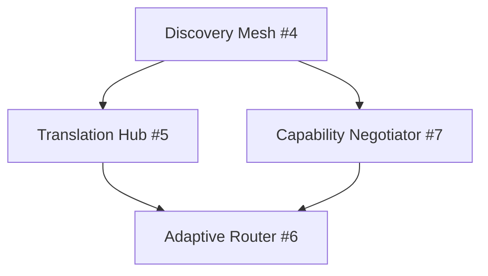
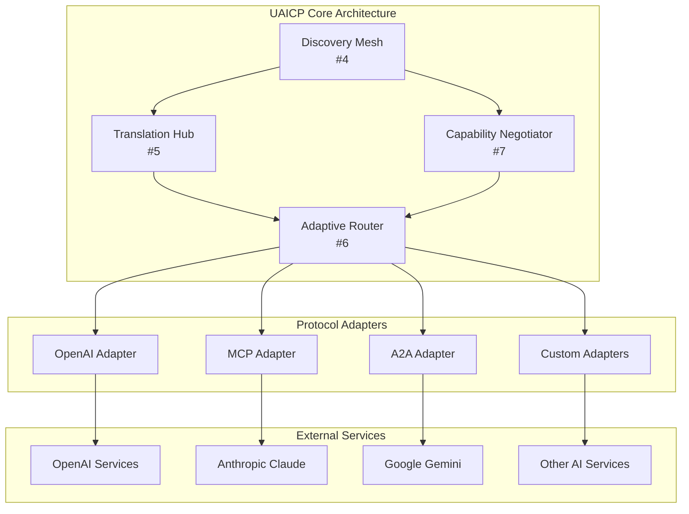

# UAICP Project Roadmap & Management Structure

## 🎯 Project Overview

The Universal AI Communication Protocol (UAICP) is an ambitious open-source initiative to create a meta-protocol framework that enables seamless communication and interoperability between diverse AI systems across different providers and platforms.

## 📋 Current Status

### ✅ **Phase 1A: Foundation Completed**
- **Governance Framework**: Comprehensive governance structure established
- **IP Policy**: Clear intellectual property guidelines defined  
- **Contribution Guidelines**: Community participation framework ready
- **Integration Guides**: MCP and OpenAI integration guides created
- **Test Specifications**: Comprehensive compliance testing framework
- **Reference Implementation**: Universal Discovery Mesh foundation laid

### 🚀 **Active Pull Request**
- **PR #1**: [Foundational governance, integration guides, tests, and reference implementations](https://github.com/UAICP/uaicp_specification/pull/1)

## 🗓️ Development Phases & Milestones

### **Phase 1: Foundation & Governance** (Due: July 1, 2025)
**Objective**: Establish foundational governance, documentation, and community infrastructure

#### Key Issues:
- **#2**: [Establish Technical Steering Committee (TSC)](https://github.com/UAICP/uaicp_specification/issues/2) 🏛️
- **#3**: [Set up Working Groups](https://github.com/UAICP/uaicp_specification/issues/3) 👥

#### Success Criteria:
- ✅ Governance framework approved and operational
- ✅ IP policy established  
- ✅ Contribution guidelines published
- 🔄 TSC established with 7-9 diverse members
- 🔄 Four working groups operational
- 🔄 Community communication channels active

---

### **Phase 2: Core Implementation** (Due: September 1, 2025)
**Objective**: Develop and test core UAICP components

#### Key Issues:
- **#4**: [Complete Universal Discovery Mesh Implementation](https://github.com/UAICP/uaicp_specification/issues/4) 🔍
- **#5**: [Develop Protocol Translation Hub](https://github.com/UAICP/uaicp_specification/issues/5) 🔄
- **#6**: [Build Adaptive Router Implementation](https://github.com/UAICP/uaicp_specification/issues/6) 🧠
- **#7**: [Implement Capability Negotiator](https://github.com/UAICP/uaicp_specification/issues/7) 🤝

#### Component Dependencies:

#### Success Criteria:
- All four core components implemented and tested
- Integration between components functional
- Performance benchmarks met
- Security requirements satisfied

---

### **Phase 3: Protocol Integration** (Due: November 1, 2025)
**Objective**: Complete integration guides and adapters for major AI protocols

#### Key Issues:
- **#8**: [Develop Comprehensive Integration Test Suite](https://github.com/UAICP/uaicp_specification/issues/8) 🧪
- **#9**: [Complete Google A2A Integration Guide](https://github.com/UAICP/uaicp_specification/issues/9) 📖
- **#11**: [Develop UAICP SDK and Developer Tools](https://github.com/UAICP/uaicp_specification/issues/11) 🛠️
- **#12**: [Launch UAICP Community Program](https://github.com/UAICP/uaicp_specification/issues/12) 🌟

#### Protocol Integration Matrix:
| Source Protocol | Target Protocol | Status | Integration Guide |
|----------------|----------------|---------|------------------|
| OpenAI | MCP | ✅ Complete | [Guide Available](docs/integration-guides/MCP-INTEGRATION.md) |
| OpenAI | Custom | ✅ Complete | [Guide Available](docs/integration-guides/OPENAI-INTEGRATION.md) |
| MCP | OpenAI | ✅ Complete | [Guide Available](docs/integration-guides/MCP-INTEGRATION.md) |
| Google A2A | OpenAI | 🔄 In Development | Issue #9 |
| Google A2A | MCP | 🔄 In Development | Issue #9 |
| Custom | All | 🔄 Framework Ready | SDK Issue #11 |

#### Success Criteria:
- Integration guides for 5+ major protocols
- SDKs available in 4+ programming languages
- 1000+ community members
- 20+ production implementations

---

### **Phase 4: Production Ready** (Due: January 1, 2026)
**Objective**: Complete compliance testing, security audits, and production-ready implementations

#### Key Issues:
- **#10**: [Establish UAICP Compliance Certification Program](https://github.com/UAICP/uaicp_specification/issues/10) 🏆

#### Success Criteria:
- Formal compliance certification program operational
- Security audits completed
- Production-grade implementations available
- Enterprise adoption demonstrated

## 🏗️ Project Architecture

### Core Components Interdependency

## 👥 Governance Structure

### Technical Steering Committee (TSC)
- **Role**: Strategic oversight and final decision authority
- **Composition**: 7-9 members from diverse stakeholder categories
- **Status**: 🔄 Issue #2 - Formation in progress

### Working Groups
1. **Security Working Group** - Security framework, authentication, encryption
2. **Discovery Working Group** - Service discovery mechanisms and protocols  
3. **Translation Working Group** - Protocol translation and interoperability
4. **Implementation Working Group** - Reference implementations and compliance testing
- **Status**: 🔄 Issue #3 - Setup in progress

## 📊 Success Metrics & KPIs

### Technical Metrics
- **Interoperability**: 95%+ successful cross-protocol communication
- **Performance**: <2s average discovery time, <100ms translation latency
- **Reliability**: 99.9% uptime for core services
- **Coverage**: Support for 10+ major AI protocols

### Community Metrics  
- **Adoption**: 1000+ community members, 100+ contributors
- **Implementation**: 50+ production deployments
- **Certification**: 20+ certified implementations
- **Integration**: 15+ protocol integrations

### Business Impact
- **Enterprise Adoption**: 10+ enterprise customers
- **Cost Savings**: Demonstrated ROI for implementers
- **Innovation**: 5+ new AI interoperability use cases enabled
- **Standards**: Recognition as industry standard for AI interoperability

## 🚀 Getting Started

### For Contributors
1. **Read**: [CONTRIBUTING.md](governance/CONTRIBUTING.md)
2. **Engage**: Join [GitHub Discussions](https://github.com/UAICP/uaicp_specification/discussions)
3. **Contribute**: Pick an issue labeled `good first issue`
4. **Connect**: Join working groups aligned with your expertise

### For Implementers
1. **Study**: Review the [UAICP Specification](docs/specification/specification.md)
2. **Integrate**: Follow [Integration Guides](docs/integration-guides/)
3. **Test**: Use [Compliance Tests](tests/COMPLIANCE-TESTS.md)
4. **Certify**: Pursue UAICP compliance certification

### For Organizations
1. **Evaluate**: Assess UAICP benefits for your AI ecosystem
2. **Pilot**: Implement UAICP in non-critical systems first
3. **Scale**: Roll out to production systems
4. **Contribute**: Share learnings and contribute to the specification

## 📞 Contact & Support

### Technical Support
- **GitHub Issues**: [Report bugs and request features](https://github.com/UAICP/uaicp_specification/issues)
- **Discussions**: [Community Q&A and discussions](https://github.com/UAICP/uaicp_specification/discussions)
- **Email**: [technical-support@uaicp.org](mailto:technical-support@uaicp.org)

### Community
- **Community Forum**: https://community.uaicp.org (Coming Soon)
- **Slack Workspace**: https://uaicp.slack.com (Coming Soon)
- **Mailing List**: [announcements@uaicp.org](mailto:announcements@uaicp.org)

### Governance
- **TSC Contact**: [tsc@uaicp.org](mailto:tsc@uaicp.org)
- **IP Policy**: [ip-policy@uaicp.org](mailto:ip-policy@uaicp.org)
- **General Inquiries**: [governance@uaicp.org](mailto:governance@uaicp.org)

---

## 🎉 Project Status Summary

### ✅ **Achievements**
- Comprehensive governance framework established
- Foundational documentation complete
- Community contribution pathways defined
- Initial reference implementations started
- Project roadmap and milestones defined

### 🔄 **In Progress**
- PR #1 under review for foundational infrastructure
- TSC formation and working group establishment
- Core component implementation planning

### 🎯 **Next Steps**
1. **Immediate (Next 2 weeks)**:
   - Merge foundational PR #1
   - Begin TSC member recruitment
   - Set up working group charters
   
2. **Short-term (Next 2 months)**:
   - Complete Discovery Mesh implementation
   - Begin Protocol Translation Hub development
   - Expand integration guide coverage
   
3. **Medium-term (Next 6 months)**:
   - Launch all core components
   - Establish community program
   - Begin compliance certification program

**The UAICP project is positioned to become the definitive standard for AI protocol interoperability, enabling a more connected and efficient AI ecosystem for all stakeholders.**

---

*Last Updated: May 22, 2025*  
*Next Review: June 1, 2025*
